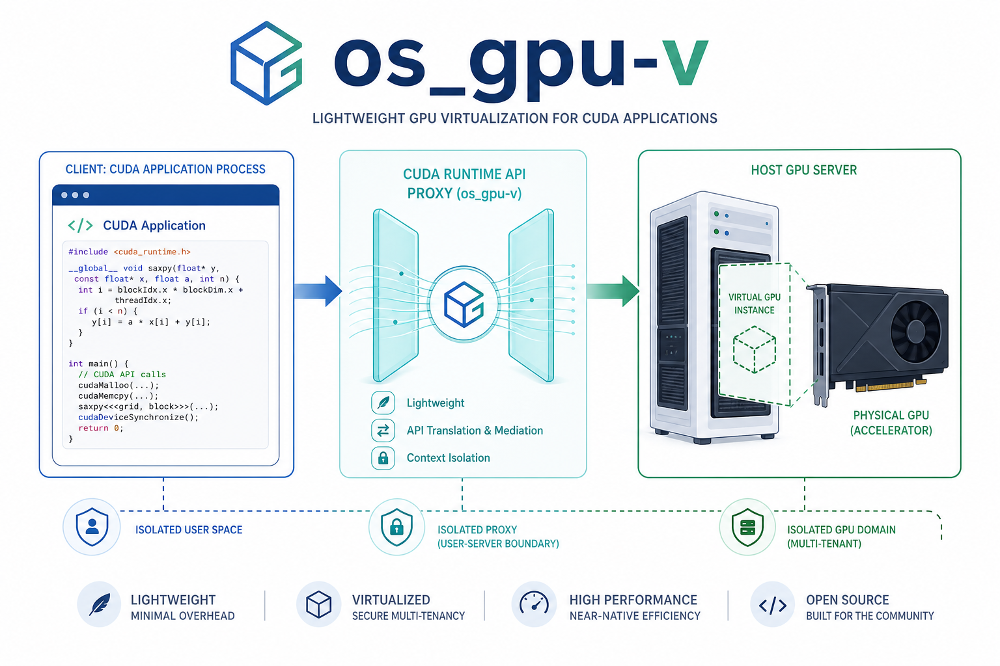

# os_gpu-v

`os_gpu-v` 是面向全国大学生计算机系统能力大赛操作系统设计赛道 `proj43` 的轻量化 GPU 虚拟化原型。项目在 CUDA Runtime API 层截获用户 GPU 进程的运行请求，把必要的显存、kernel、stream/event 和同步信息转发到 server，由 server 通过 CUDA Driver API 在 NVIDIA GPU 上执行。

赛题要求以 GPU 运行进程为基本虚拟化单位，截获客户机中用户 GPU 进程运行的算子信息，并转发到宿主机 GPU 上运行；同时通过并发操作、数据同步和数据通路优化降低迁移与转发开销。本项目围绕这个目标实现了 Runtime API proxy、per-session 资源隔离、virtual pointer、shared memory 数据面和 SPSC ring fast path。



## 项目信息

| 项目 | 内容 |
| --- | --- |
| 赛题编号 | `proj43` |
| 赛题方向 | 轻量化 GPU 虚拟化 |
| 项目名称 | `os_gpu-v` |
| 核心思路 | CUDA Runtime API 拦截 + server 侧 CUDA Driver API 执行 |
| 主要验证 | vector add、matrix multiply、H2D/D2H/D2D memcpy、stream/event、双进程并发、稳定性测试 |
| 项目报告 | [docs/project_report.md](docs/project_report.md) |

## 核心能力

- 使用 `LD_PRELOAD` 截获 CUDA Runtime API。
- 为每个 client 进程创建独立 session，隔离显存、module、stream、event 和错误状态。
- 使用 session-local virtual pointer 表示 client 可见的 device pointer。
- server 端通过 CUDA Driver API 执行真实 GPU 操作。
- H2D/D2H 大块数据使用 POSIX shared memory data arena。
- kernel launch、D2D copy 和 sync 走 per-session SPSC ring fast path。
- 支持 stream/event 基本语义、双进程并发和跨 session 同步隔离。
- Client 端后台保活心跳，防止低频调用 session 被误清理。
- Ring 操作超时自动回退到 gRPC 路径。
- O(log n) virtual pointer 查找（有序映射 vs 线性扫描）。
- Server 端 session 清理时同步清除共享内存段。
- 提供功能、性能、稳定性和负例测试脚本。

## 数据路径

项目把不同类型的请求拆成三条路径，避免所有数据都挤在普通 RPC 中。低频控制请求通过 gRPC 传递结构化信息；H2D/D2H 大块数据通过 shared memory 传递；高频小命令通过 per-session SPSC ring 提交给 server worker。

## 仓库结构

```text
client/     CUDA Runtime proxy library
server/     vGPU server, session manager, ring worker
proto/      gRPC/protobuf service definition
shared/     shared-memory ring structures
tools/
  smoke/      基础功能测试（vector add, memcpy, stream, event, ...）
  stress/     压力稳定性测试
  concurrency/  多进程并发和跨 session 测试
  benchmark/    性能基准测试
  scripts/     Python 验收验证脚本
docs/
  assets/     README 和报告使用的项目配图
  project_report.md
```

## 依赖

- Linux
- CMake 3.20+
- C++17 compiler
- protobuf and gRPC C++ development packages
- NVIDIA CUDA Toolkit
- NVIDIA driver available to the server process
- Python 3 for acceptance scripts

protobuf/gRPC 可以通过系统包管理器安装，也可以使用 vcpkg、conda 或其他能暴露 CMake package config 的工具链。

## 构建

构建核心组件：

```bash
cmake -S . -B build -DCMAKE_BUILD_TYPE=Release
cmake --build build -j
```

如果环境中有 `nvcc`，可以同时构建 CUDA 验收测试：

```bash
cmake -S . -B build -DCMAKE_BUILD_TYPE=Release -DVGPU_BUILD_CUDA_TESTS=ON
cmake --build build -j
```

主要产物：

```text
build/vgpu_server
build/libcudart_proxy.so
```

## 快速运行

启动 server：

```bash
./build/vgpu_server 127.0.0.1:50052
```

运行一个通过 proxy 的 CUDA 测试程序：

```bash
VGPU_DATA_PLANE=shm \
NO_PROXY=127.0.0.1,localhost \
LD_PRELOAD="$PWD/build/libcudart_proxy.so" \
VGPU_SERVER=127.0.0.1:50052 \
./build/vgpu_vector_add_smoke
```

如果没有通过 CMake 构建 CUDA 测试程序，也可以手动编译：

```bash
nvcc -std=c++17 -cudart shared tools/smoke/vector_add_smoke.cu -o /tmp/vgpu_vector_add_smoke
```

然后运行：

```bash
VGPU_DATA_PLANE=shm \
NO_PROXY=127.0.0.1,localhost \
LD_PRELOAD="$PWD/build/libcudart_proxy.so" \
VGPU_SERVER=127.0.0.1:50052 \
/tmp/vgpu_vector_add_smoke
```

## 验收测试

构建测试程序（仅当使用手动 nvcc 编译时需要）：

```bash
nvcc -std=c++17 -cudart shared tools/concurrency/concurrent_worker.cu -o /tmp/vgpu_concurrent_worker
nvcc -std=c++17 -cudart shared tools/benchmark/matrix_mul_benchmark.cu -o /tmp/vgpu_matrix_mul_benchmark
nvcc -std=c++17 -cudart shared tools/concurrency/cross_session_sync_test.cu -o /tmp/vgpu_cross_session_sync_test
```

运行主要验收脚本（使用 CMake 构建的测试程序）：

```bash
./tools/scripts/run_acceptance_validation.py \
  --server 127.0.0.1:50052 \
  --proxy-lib "$PWD/build/libcudart_proxy.so" \
  --skip-stability
```

运行跨 session 同步隔离测试：

```bash
./tools/scripts/run_cross_session_sync_test.py \
  --server 127.0.0.1:50052 \
  --proxy-lib "$PWD/build/libcudart_proxy.so"
```

运行完整 10 分钟稳定性测试：

```bash
./tools/scripts/run_acceptance_validation.py \
  --server 127.0.0.1:50052 \
  --proxy-lib "$PWD/build/libcudart_proxy.so" \
  --stability-seconds 600
```

## 环境变量

| 变量 | 默认值 | 说明 |
|---|---|---|
| `VGPU_SERVER` | `127.0.0.1:50051` | Server 地址 |
| `VGPU_DATA_PLANE` | 空（走 gRPC） | 设为 `shm` 启用共享内存数据面 |
| `VGPU_SHM_SIZE` | 67108864 (64 MB) | 共享内存大小 |
| `VGPU_SHM_THRESHOLD` | 65536 (64 KB) | 启用 SHM 路径的最小传输量 |
| `VGPU_MEMORY_LIMIT` | 0（无限制） | 每 session GPU 内存上限 |
| `VGPU_SESSION_TIMEOUT_MS` | 30000 | Session 空闲超时时间（毫秒） |
| `VGPU_RING_TIMEOUT_US` | 5000000 | Ring 操作超时（微秒）；超时后禁用 ring 回退到 gRPC |
| `VGPU_PERF_DETAIL` | 0 | 设为 `1` 启用详细性能日志 |
| `VGPU_INIT_TRACE` | 0 | 设为 `1` 启用初始化耗时追踪 |

## 文档

- [项目报告](docs/project_report.md)
- [项目封面图](docs/assets/project-cover.png)
- [session 隔离示意图](docs/assets/session-isolation.png)
